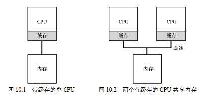

10 多处理器调度
===

**概述**  
当有多个cpu时,进程调度不可避免就会有并发问题出现.目前大概有两种调度策略,一种是单队列调度,一种是多队列调度.二者各有利弊,都有系统采用.

**概念解释**  
*   缓存:    
    为了加快cpu对内存的访问,每个cpu都有自己的缓存cache,第一次访问内存的数据会拷贝一份到缓存中,第二次访问时直接从缓存中取  
    
*   缓存一致性
    假设多个cpu缓存都有同一份数据,某一cpu更改该数据时,更改之前会将其它cpu缓存的该数据缓存置为无效,然后再更新.在硬件层面保证共享内存的唯一性
    
1.  **单队列调度**  
Single-Queue Scheduling 故名思意,把所有需要调度的进程放到同一队列中,优点是简单,可以方便应用现有的调度策略,且方便负载均衡,而不需要做其它工作.
缺点也很明显,缺乏扩展性,因为是单一队列,涉及到并发问题,对代码需要加锁来保证原子性. 加锁是一种非常消耗性能的操作,且随着cpu的个数增加,消耗越大.
还有个缺点是缓存亲和性不友好,进程运行时的数据会存在缓存中,如果因为进程切换,下次切换到另一个cpu执行,因为切换后的cpu缓存里没有原来的数据,
所以会从之前的缓存(没有的从内存)取,这会产生一定的性能消耗

2.  **多队列调度**  
Multi-Queue MultiProcessor Scheduling 每个cpu都有一个队列管理进程.进程到来时,系统会将任务加入随机或选择空的队列. 跟单队列调度相对应,
优点是可扩展性和缓存亲和性友好.每个cpu都有一个队列所以不会有锁和缓存的问题. 相对应的,缺点就是负载均衡不够友好,可能出现某些cpu的队列任务
执行完的情况下或只有少量进程,而其它队列还有很多进程在执行.虽然可以通过迁移进程到空的队列的方法改善,但同时也会出现并发问题,带来性能消耗