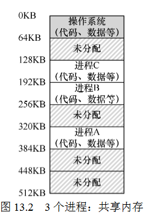
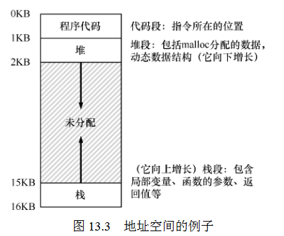

13 抽象:地址空间
===
**概述:**  
内存memory可以看作是一个长长的数组(i.e.,4GB,8GB或更多),为了让每个进程都有自己独立的内存空间.操作系统给每个进程都分配了物理内存空间,但只提供给进程虚拟地址,用户能看到的都是虚拟地址,至于虚拟地址和真实物理地址的映射则由操作系统完成,这部分对用户是透明的,用户其实也不用关心简单的分配方式如下图所示,可以看出物理层面,内存都隔离开了.

1.  **地址空间**  
    地址空间包含运行的程序的所有内存状态.包括程序代码,堆,栈.代码是静态的,不会动态增加会减少,直接放在最上面.堆和栈会动态变化,放在上面和下面,可以往中间动态增加.栈用来保存当前的函数调用信息,局部变量,方法参数和返回值.堆用于动态分配的,用户管理的内存.比如c语言的molloc()或Java的new 对象创建等.
    