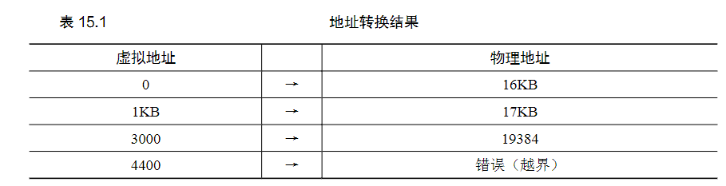
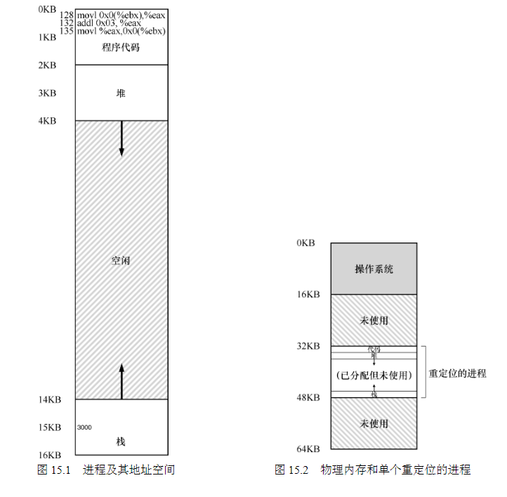

15 地址转换 Address Translation
===

**概述:**  
不管有多少个进程在执行,它们都是共享一大块4GB或更多内存.操作系统和硬件结合,通过地址转换技术,一起高效,灵活,并有效控制着内存分配管理.硬件层面,

1.  **硬件层面**  
每个cpu都有一对[基址(base)寄存器] + [界限(bound)寄存器],base决定进程内存的实际物理地址起点,bound决定虚拟地址的范围,即进程不能访问
超过范围的内存.实际运行时,cpu 通过 base+虚拟地址 = 实际物理地址 访问真实地址的数据,达到地址转化的目的. 通过这种机制,虽然进程的内存空间都是独立分散在整个
内存的各个地方,但是每个进程的虚拟地址都是从0开始,这部分对进程是透明的,同时提供修改base和bound的功能,当然这也属于内核特权操作.

2.  **操作系统层面**  
硬件提供的base+bound机制,方便高效的转化虚拟地址,但是对内存的精细管理还需要操作系统介入. 哪些内存地址是可用的,哪些是不可用的,都需要
操作系统进行追踪. 进程运行之前,操作系统需要指定该进程的实际物理地址起点(即base)和范围(bound). 根据内存的分配使用情况,为了提高内存的
利用率,操作系统还可能会动态的转移内存.

**转化示例:**  

**内存分配例:**  

