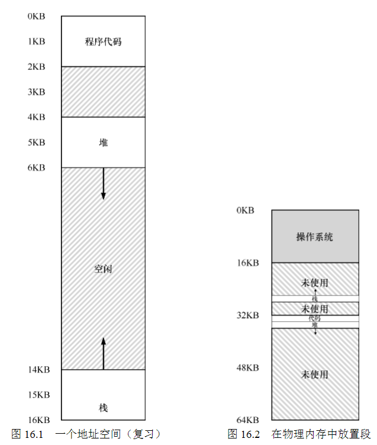

16 Segmentation 分段
===

**概述:**  
假设每个进程的内存空间都占用的是一整段连续的内存,容易造成内存空间的浪费,比如heap和stack中间那一段.为了避免大量的内存浪费,采用分段机制,将进程的内存切分为三个逻辑段:代码段,heap段,stack段.同时也可以方便内存共享,进一步节省内存,尤其是代码共享. 将代码段设置成只可读,则可以在不同进程间共享. 当然这样做也有缺点,比如可能会造成很多未使用的内存碎片造成浪费,称为外部碎片问题.解决这个问题的一种方法是终止运行的进程,将它们的数据复制到连续的内存去,紧凑使用内存.

**分段内存分配例:**  
