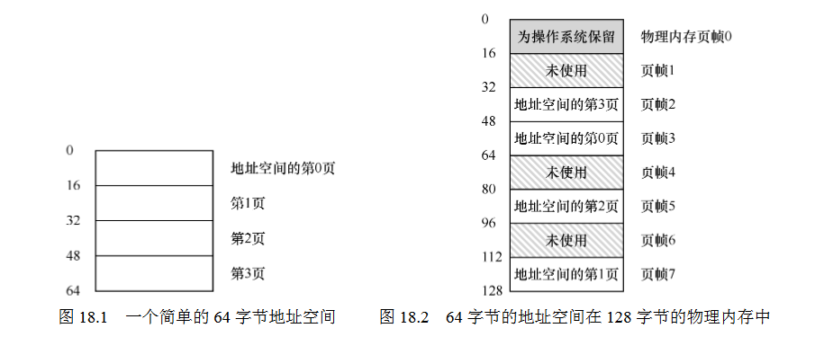

18 Introduction to Paging 分页介绍
===

**概述:**  
前面说到的分段管理空闲空间的方式是非常灵活方便的,但同时也容易造成内存碎片问题. 采用内存分页,则可以解决这个问题. 分页是把内存分成很多固定大小(一般比较小)的分片. 通过分片组合来分配内存,可有效降低内存碎片化的问题. 但同时也会带来运行速度慢,分页映射表(即页表)占用内存过大的问题.为了记录地址空间的每个虚拟页放在物理内存中的位置，操作系统为每个进程保存一个数据结构，称为页表（page table),用于虚拟地址到真实地址的转化,因为每个进程都有一个页表管理,所以所有进程的页表加起来会占用不少的内存,接下来的两章节会介绍怎么解决这方面的问题.
