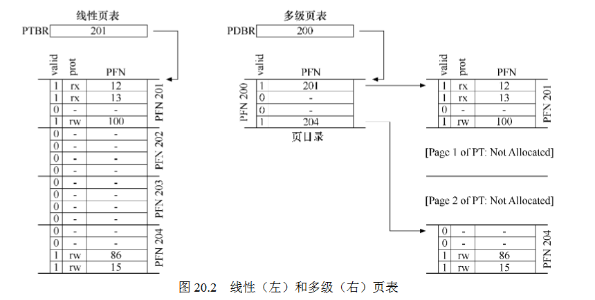

20 Advanced Page Tables 分页:较小的表
===

**概述:**  
分页的第二个问题:内存消耗太大.这个问题有以下几种方案

1.  **更大的分页**  
    一种简单的解决方案是采用更大的分页,这样页数则变少,页表占用内存自然就变小,但是更大的分页会造成内部碎片问题,即分页内部有很多未真正使用的内存.

2.  **分段+分页**  
    还有一种解决方案是采用前面介绍的分段+分页的方式来管理内存. 单独有页表来管理内存有一个问题是,比如堆heap和栈stack之间可能会有很多未使用的页,但分页的项还是存在页表中占用空间. 使用逻辑分段:代码段,堆段,栈段,每个段都有属于自己的页表,这种方式可以避免未使用的分页项占用页表空间.但是分段始终会造成外部内存碎片问题.

3.  **多级页表**  
    简单来说,就是将线性页表转化成树的结构. 首先将页表分成页大小的单元,即将页表本身再次分页,如果分页中的所有项都是无效的,则不分配项管理,因此可以减少无效分页的内存浪费.当然因为采用了多级结构,在分页查找上会有一些消耗,但综合考虑是非常有效的方案,很多现代系统都采用它.  
    多级页表例:
    