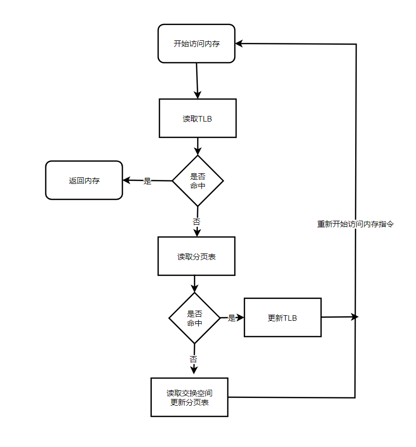

21 Swapping Mechanisms 超越物理内存:交换机制
===

**概述:**  
早期的机器不能把所有进程需要的所有页同时放在内存中,因此,多进程系统需要操作系统支持比物理内存更大的地址空间.让所有进程不必担心程序的数据是否有足够空间存储.交换机制则可以达到这个目的.简单来说,在物理内存不够的时候,交换机制通过交换物理内存中不常用的分页到硬盘的交换空间(提前开辟好的)中,提供内存.  

1.  **交换空间**  
一般存在硬盘上,空间比内存大很多.为了方便分页的写入和读出,操作系统一般会以页大小为单位读取或写入

2.  **存在位**  
我们知道分页的位置信息是存在分页表中的,如果分页被交换到交换空间了,在分页项中如何体现呢?这就用到存在位了,分页项会有一个比特位来表示该分页是否被交换了,1代表存在物理内存中,0代表被交换了.访问被交换的分页时,会产生页错误中断(page fault)

3.  **页错误**  
当页错误产生时,操作系统会被唤醒,用以存在操作系统的页错误处理程序(page-fault handler)处理. 操作系统会读取分页项中查找交换地址,读入内存,然后更新分页表的存在位,并重新开始读取分页指令.

包含页错误的内存访问流程图:

4.  **交换策略**  
为了保证始终有少量的空闲内存,操作系统会设置高水位线(HW)和低水位线(LW),当操作系统发现空闲内存少于LW时,则启动后台负责释放内存的线程,直到有HW可用的物理内存分页.