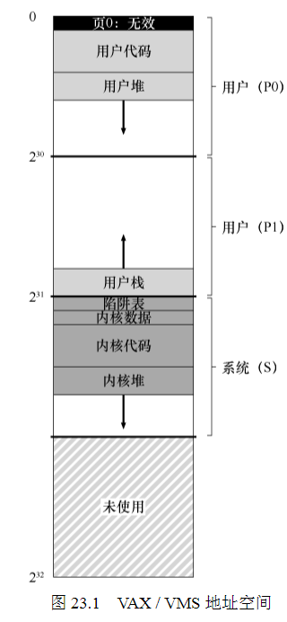

23 Complete VM Systems 完整的虚拟内存系统

**概述:**  
以70年代诞生的VMS操作系统为例,介绍真实的完整虚拟内存系统,真是的虚拟操作系统跟之前讨论的一个重要区别在于,内核虚拟空间是每个用户地址空间的一部分,实际上只是一个空间,通过映射到每个地址空间.  

vms地址空间:

1.  **页交换**  
vms采用分段FIFO交换策略.每个进程都有一个保存在内存的最大页数,成为RSS. 当一个进程的页数超过RSS时,先入的页被交换. 纯粹的FIFO性能不好,VMS引入二次机会列表机制,分为干净页列表和脏页列表.页在被交换之前放在二次列表中.当页被交换时,如果干净(未修改),则将其放在干净页表末尾,如果修改过则放在脏页列表末尾. 如果另一进程需要空闲页,则从干净页表取. 如果原来的进程在回收之前在该页上出现页错误,则会从空闲(或脏)列表中回收,避免昂贵的磁盘访问.同时VMS通过将大批量的页从脏列表分组在一起,将它们一举写入磁盘,以页聚集的方式执行更少和更大的写入,提高性能.

2.  **其他虚拟内存技巧**  
    *   按需置零  
        简单来说就是现在页表中放入一个不可访问的条目,当进程读取或写入该页时,引发跳转,然后操作系统才寻找物理页,放入页表中.好处在于,可以节省进程加载了但不使用页的空间.

    *   写时复制(copy-on-write COW)
        如果需要一个页面从一个空间复制到另一个空间,实际不复制,而是将其映射到目标地址空间,当需要写入修改时,再重新分配页,真正复制填充数据,如果只是读取数据,这种方式可以省下内存.