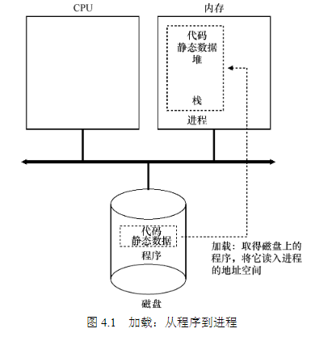
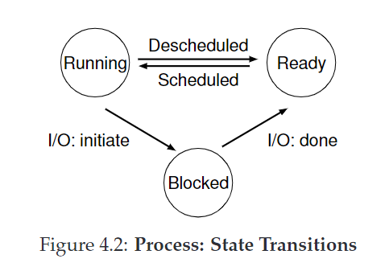
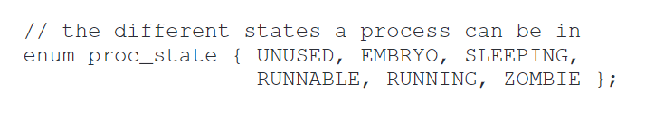
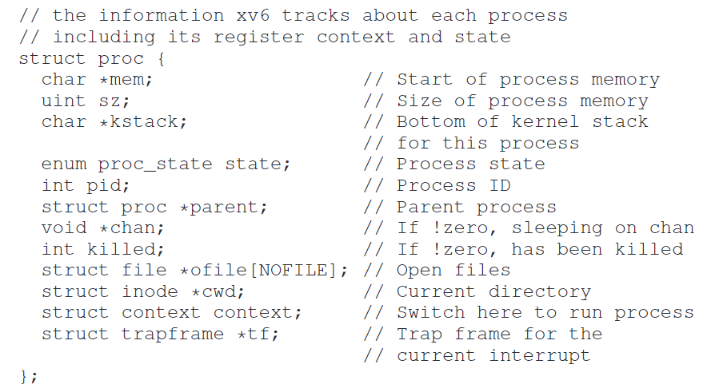

4 抽象:进程
=
**概述**:
进程的定义:运行的程序    
我们知道程序的运行都需要靠CPU运行,但是我们平时用电脑都是很多个程序同时(至少给人感觉)在运行,难道计算机有很多很多CPU? 当然我们知道计算机只有一个或几个有限的CPU,计算机通过虚拟化CPU,来回迅速的切换运行不同的进程,从而达到同时运行多个任务的目的.
为了实现这个目的,操作系统需要底层的机器机制和上层的策略.  
底层的机器机制举例:环境切换(context switch),分时机制(time sharing)...
上层策略: 调度策略...

1.  **存储在磁盘里的程序是怎么加载运行变成进程的?**
    *   操作系统首先将代码和静态数据加载到进程的内存地址空间
    *   分配一些内存作为进程运行时的栈(用于存放局部变量,函数参数,返回地址))
    *   分配一些内存作为进程的堆(heap),(用于存放动态分配的数据)
    *   其它初始任务:
        *   一般会默认分配三个输出流:标准输入流(input),标准输出流(output),标准错误流(error)
    *   最后:跳到程序执行入口即main()运行
    

2.  **进程的状态(简单来说有3种)**
    *   运行(Running):正在运行
    *   就绪(Ready):运行就绪,因为某些原因操作系统没选择它运行
    *   阻塞(Block):执行了某些操作(比如I/O操作),直到某些事件发生才会准备运行
    

3.  **进程相关的数据结构**
    *   context : 进程相关的寄存器内容,当切换进程时会将该进程的寄存器内容存起来,当再次切换回来的时候将之前存起来的寄存器内容一一加载到真实的寄存器中
        
    *   proc_state: 进程的状态枚举
        
    *   proc: 进程的相关信息,包括进程id,父进程id,context的引用,proc_state值等
        
