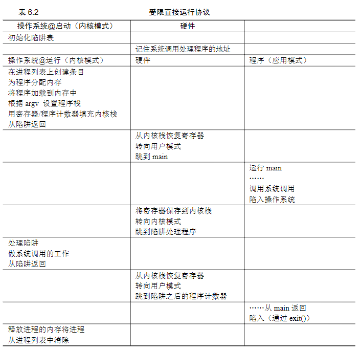
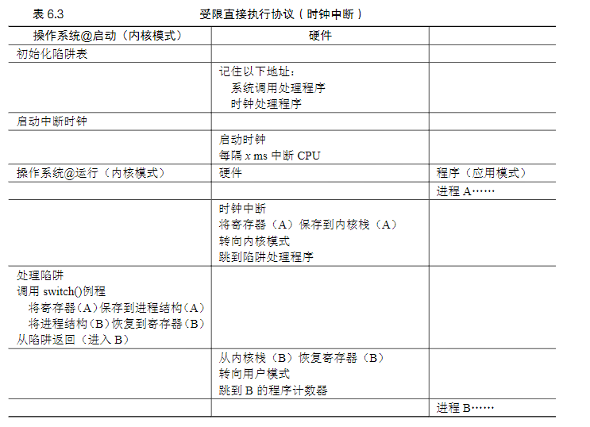

6 受限直接执行
=

**概述** 
问题1:操作系统怎么能确保程序不做我们不希望它做的事请,比如擅自更改操作系统内部文件
问题2:运行一个进程时,操作系统如何让它停下来,并切换到另一个进程,从而实现虚拟化cpu所需的时分共享

1.  **受限制的操作**
操作系统采用用户模式和内核模式来限制进程操作. 系统会暴露只有内核模式才能执行的系统调用命令编号,但是不会暴露具体的系统调用代码地址.用户模式的进程想执行I/O等系统调用时,通过调用trap(陷阱)命令切换到内核模式执行. 内核会初始化一个trap(陷阱)命令表,表里有命令编号,和响应的处理代码地址. 用户模式只知道命令编号,但不知道命令代码地址,从而防止程序直接执行特殊操作
    *   用户模式
        程序会收到限制,比如不能直接执行I/O请求等特权操作
    *   内核模式
        程序不受限制
    *   用户模式和内核模式的切换**
        用户模式切换到内核模式时,用户模式的寄存器值会保存到内核栈,当内核操作完成后,切换会用户模式时会重新加载.
        
2.  **进程之间的切换**
操作系统通过每隔几毫秒就产生的时钟中断(timer interrupt)机制,中断运行中的进程,重获cpu的控制权,可以启动任一操作系统想启动的进程,达到进程切换的目的.如果操作系统决定切换进程,会执行上下文切换操作.即保存当前执行进程的寄存器值,程序计数器,内核栈指针等,然后加载即将运行进程的寄存器值,程序计数器,内核栈指针等
