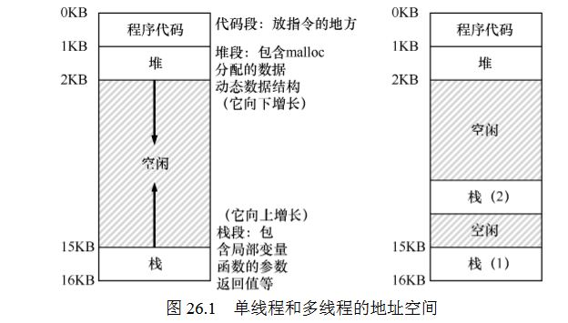
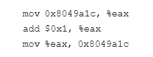
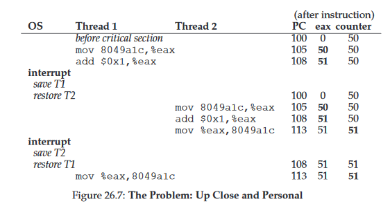

26 Concurrency and Threads 并发和线程
===
**概述:**  
为什么需要线程?一是因为有并行运算的需求,通过多线程可以提高运算速度;二是提高cpu的使用率,特别是有I/O的情况,以前只有进程的时候,
发生I/0时,进程就只能被阻塞,不能干其它的事情,有了多线程,则可以切换到其它线程运行.

1.  线程与进程的不同  
    一个进程通常包含多个线程.线程可以想象成是小型的进程.
    *   内存共享  
    同一进程里的多线程共享内存空间,可以访问相同的数据,而进程与进程之前是不共享内存的.
    *   环境切换
    每个线程都有自己栈内存,有自己的寄存器,发生环境切换时,线程将状态保存到TCB(Thread Control Block),但不会切换地址空间(因为共享内存),
    而进程将状态保存在PCB(Process Control Block),会切换地址空间(因为有各自的内存空间)
    
    
2.  共享数据问题
    线程虽然可以提高程序运算速度和cpu的使用率,但是因为可以访问相同的数据,并发更新数据时就容易出现问题.问题的根本在于更新数据的代码执行并非原子性,而线程切换调度又是不可确定性.
    比如:counter = counter + 1,编译成汇编语言可能就像下面这样    
      
    每一条指令执行后都有可能被切换到其它同样执行这一代码的线程,从而引发共享数据问题.  
    可能的结果是下面这样的:  
    

3.  原子性愿望
    上述的共享数据问题,原因在于更新数据的代码没有一步执行到位.解决的方案就是使用一种机制让产生数据共享问题的代码,在多线程的环境下,即使发生环境切换,同时只让一个线程完整执行这段代码.这种机制成为原子性.要么全部执行完,要么不执行,没有中间状态.现代系统通过硬件提供有用的指令(同步原语),和操作系统的帮助来构建多线程系统.