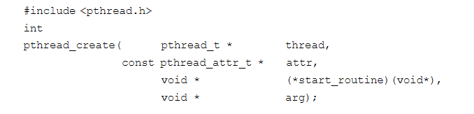
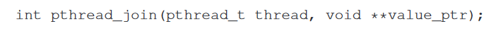
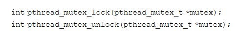
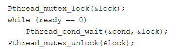
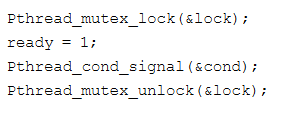

27 Thread API 线程API  
===
**概述:**  
要创建线程首先要知道线程相关的Api

1.  线程创建  
    在posix中,线程创建的api声明如下:  
    
    *   第一个参数是指向创建好线程的指针,通过该指针与线程交互
    *   第二个参数是配置线程相关的参数,比如栈的大小,线程优先级等
    *   第三个参数是该线程运行的函数,参数两边声明的void*,代表函数的传参类型和返回类型可以是任意的
    *   第四个参数是传递给函数的参数
2.  线程完成
    如果想等另外一个线程完成的时候,可以调用pthread_join接口  
    
    *   第一个参数是等待完成的线程指针
    *   第二个参数是等待线程函数的返回值指针(因为栈内分配的内存在函数调用结束后会被回收,所以用指针)

3.  锁  
    为了保证临界区的共享数据安全,一般都会用锁(lock)来保障数据安全.基本的一对函数如下:  
      
    通常的使用方式如下:  
      
    先通过pthread_mutex_lock(),获取锁,如果获取成功则进入临界区,如果另外线程持有锁,则不会返回,直到获取该锁.
4.  条件变量
    当线程之间需要发生某种信号时,条件变量就会很有用. 主要函数为下:  
      
    使用条件变量时,需要一个相关的锁,以保障不会出现共享数据问题.使用例子如下:  
    当ready为0时线程会sleep.  
      
    设置ready=1,唤醒等待的线程  
    
    通过ready变量的变化,使用条件condition和锁来唤醒或让线程沉睡.