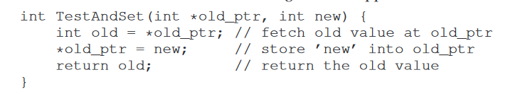
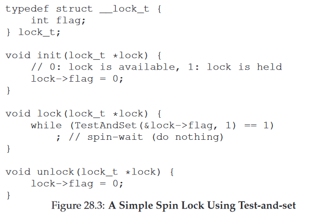
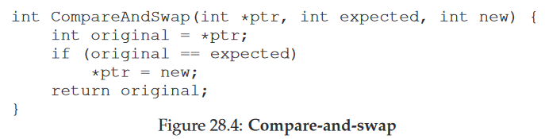
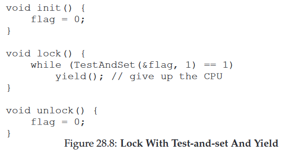

28 Locks 锁
===

**概述:**  
单纯的锁一般有自旋锁和互斥锁.自旋锁和互斥锁都可以达到锁的目的.区别在于自旋锁并不将没有获得锁的线程陷入沉睡,互斥锁一般(也可能等待一段时间再让其睡眠)会让没有获得锁的线程陷入沉睡,放入等待队列中,当有锁释放时,再唤醒其中一个.二者各有利弊,自旋锁不会陷入沉睡但是如果等待的线程比较多,且等待时间比较长,会浪费cpu资源,比较适用于多数线程占用锁时间比较短的场景.互斥锁则相反.不论哪种锁都需要硬件提供支持,即需要硬件提供类似能原子性更改变量操作的指令.不同的锁则利用这些原子指令来实现不同的策略.

1.  **Test-And-Set**  
    Test-And-Set硬件指令能提供类似下面c代码的原子性操作.能返回旧的值,并将变量设置成新的值.
      
    利用它可实现类似下面的自旋锁:  
    

2.  **Compare-And-Swap**  
    Compare-And-Swap硬件指令能提供类似下面c代码的原子性操作.返回旧的值,如果变量的值与期望值相等,则设置成新的值.
    

3.  **yield**  
    自旋锁的问题在于线程多的时候比较浪费cpu资源.那么自然想到的解决方案时,不让未获得锁的线程占用cpu.适用yield可能让线程放弃暂用cpu.虽说效果比自旋锁好,但也有可能造成很多线程执行yield浪费资源,也可能造成线程饥饿.
    

4.  **Using Queues:Sleeping Instead Of Spinning**    
    自旋锁和yield的问题在于调度程序可能选择调度的进程不是最优的线程,因此可能造成cpu浪费和线程饥饿.解决方案就是将未获取锁的线程睡眠,并放入队列,当有锁释放时,将队列中的某一线程唤醒.这个方案的缺点是,为了达到期望的效果,操作系统需要做的事情会比较多,有一定的性能消耗,因此适用于线程比较多,且多数线程持有锁的持续时间都比较长的场景.