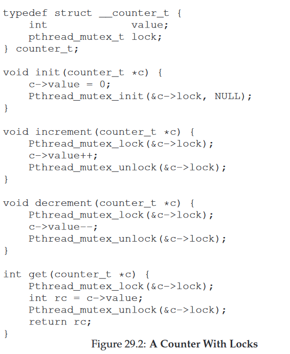
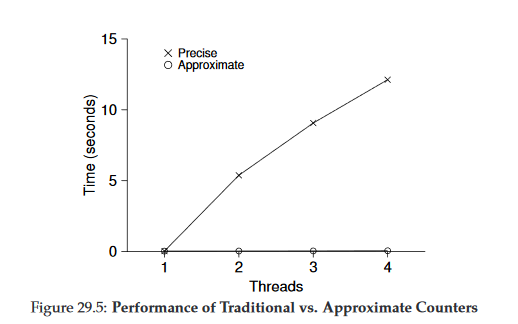
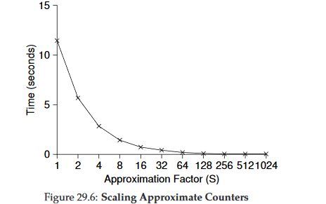
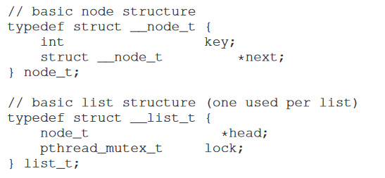
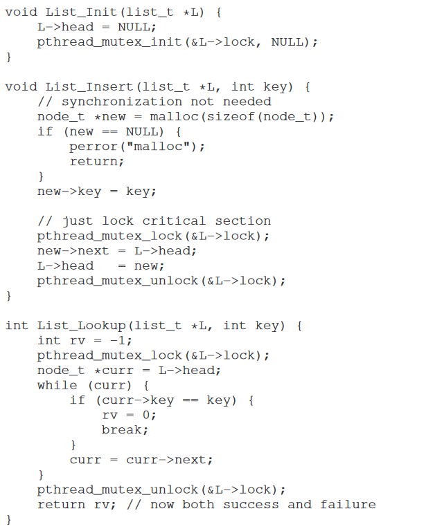
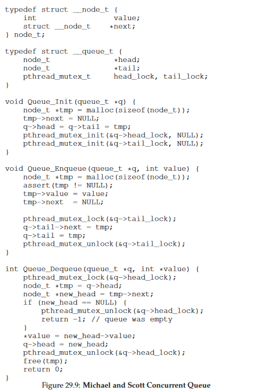
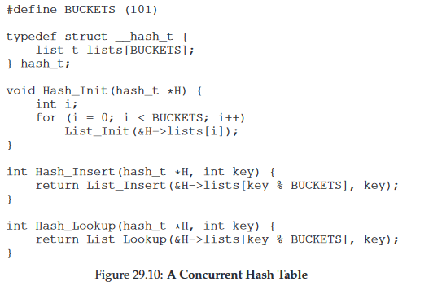

29 Locked Data Structures 基于锁的并发数据结构
===

**概述:**  
在应用中我们经常适用一些数据结构,比如列表,队列等.如何保障这些数据结构在多线程环境下线程安全,同时又不太消耗性能.本章介绍几种数据机构和加锁的方式于技巧.

1.  **并发计数器**  
    简单的实现可能会想到下面这种方式:  
      
    在增减查的地方都加了同一把锁确保了线程安全.但是比起另一种方案,性能要低不少.另一钟方案成为近似并发计数器,它的思路是,全局有一个计数器,有一把全局锁,每一个线程有一把锁,有一个本地计数器.本地计数器用本地锁来确保线程安全.当本地计数器达到提前设定好的阈值,则把本地计数器的值传递给全局计数器,然后设置本地计数器的值为0.优点在于可以利用多cpu并发计数,性能大大提升.缺点在于全局计数器的值并不是实时的.如果对计数的实时性要求不高,则可以采取这种方案.
    近似并发计数器的代码实现:  
      
    简单并发计数器和近似并发计数器的性能比较:  
      
    值得注意的是,近似并发计数的阈值越大,则它的性能表现越好.因为阈值越低,对全局锁的获取释放操作就会越频繁,从而降低性能.  
    阈值于性能的相关变化:  
    
2.  **并发链表**  
    并发链表的实现方式如下.值得注意的是,加锁和释放锁的操作只在临界区的范围进行.一方面提高性能,一方面减少加锁范围内出错的机会.
      
      
3.  **并发队列**  
    简单的实现方案略过.作为比较好的实现方案,看下下面的实现方案.它的思路是设置头尾节点,头节点有一把锁,尾节点有一把锁来保证线程安全.头节点用于取数据,尾节点用于插入数据.优点在于取数据和插入数据因为用不同的锁,所以不会互相影响.
    
4.  **并发散列表**  
    并发散列表使用并发链表实现.并发散列表拥有几个并发链表,基于一定的规则计算插入的元素应该插入到哪个列表中.使用多列表,提高并发性,提高性能.  
    简单的实现如下:(忽略了并发链表的代码和扩容的代码)  
    