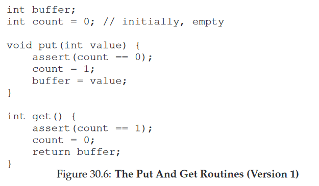
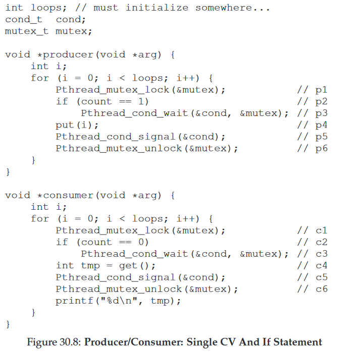
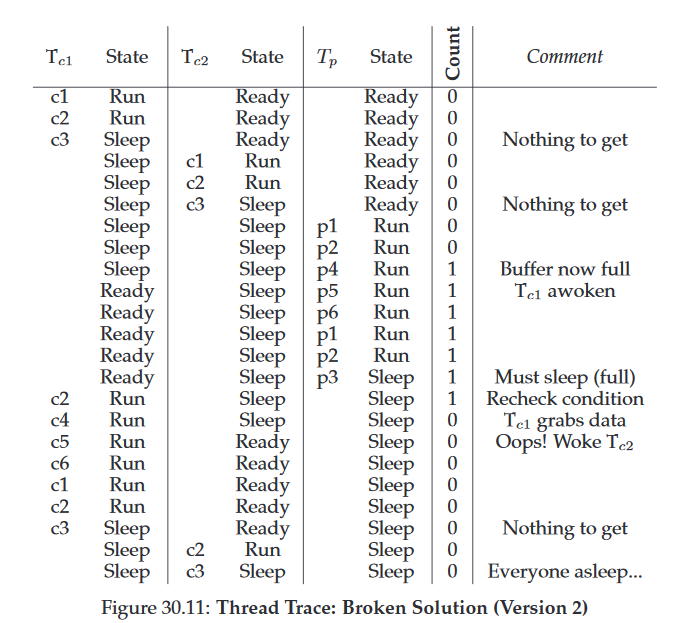
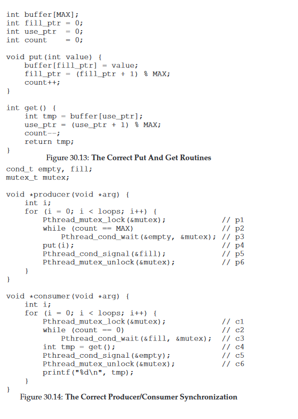

30 Condition Variables 条件变量
===

**概述:**  
当你想根据某些状态,条件的变化来更改不同线程的沉睡或运行状态,这种情况下用条件变量就比较合适.当不满足期望的条件时,条件变量可以让线程沉睡在附带的队列中,当满足条件时再唤醒.条件变量的典型应用是生产者/消费者模型.下面通过例子一步步分析条件变量是怎么正确使用的.  

1.  **没有加锁也没有加条件变量**  
      
    为了方便起见,缓存buffer就设为1个整数.这个实现明显线程不安全.但如果只是单纯的加锁,数据安全可以保证,但是不能达到很好的效果.因为生产者/消费者模型希望负责生产的线程和负责消费的线程能够交替执行.而不是随机的切换.因此单纯的锁不能满足期望.
2.  **加锁,加条件变量**  
    假设只有两个线程,一个线程负责生产,一个线程负责消费,则下面的实现可以达到期望的效果.当缓存buffer满了(有一个数),则让生产线程沉睡,唤醒消费线程.消费线程消费后唤醒生产线程,因为缓存已经空了,所以消费线程陷入沉睡.  
      
    但是当有多个消费线程的时候,上面的实现就会出现问题.首先使用if来判断条件会出现问题,假如有一个消费线程C1在wait的地方陷入沉睡,生产线程添加数据唤醒消费线程C1,但在C1执行之前,另外一个消费线程C2进来并消费了数据陷入沉睡,这时刚好轮到C1线程运行,唤醒后会从wait的下一条指令运行,即消费数据,但数据已经被C2消费掉了,所以会出错,错误的执行流程如下图所示.因此不能用if,用while则可以解决这个问题.如果用while的话,刚才假设的场景,C1唤醒执行时还会再次检测缓存buffer是否有数据,因此不会发生错误.  
      
    即使改用while之后,还是会出现问题.因为只有一个条件变量,当生产线程P1添加数据沉睡,唤醒消费线程时,有另外两个在等数据的消费线程C1,C2在等待,假设C1被唤醒然后消费数据,因为没有数据会沉睡,并会唤醒一个线程,但这时会唤醒哪个线程呢?答案时不确定的,虽然期望唤醒的是生产线程P1.假设唤醒的是C2,C2因为没有数据所以又会沉睡,这时会出现P1,C1,C2都陷入沉睡的糟糕状态.错误的流程如下图:  
    
3.  **完整正确的生产者/消费者模型**  
    当只有一个条件变量时,会出现上述的问题.解决方案就是使用两个条件变量.其实只要消费线程只唤醒生产线程,生产线程只唤醒消费线程,就不会出现问题.所以使用两个条件变量即可达到这种效果.如下实现方案,生产线程等待empty条件变量,唤醒full条件变量;消费线程则相反.同时还扩展了缓存数量,符合现实中的需求场景.当缓存满了之后生产线程才沉睡,缓存空了之后,消费线程才沉睡,这样可以让生产或消费线程每次可以多处理一些数据,减少线程切换以及沉睡唤醒等操作的代价.  
    