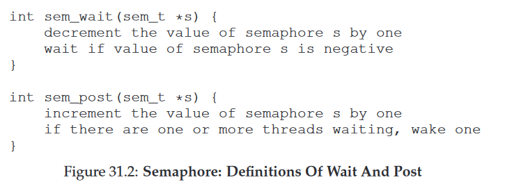
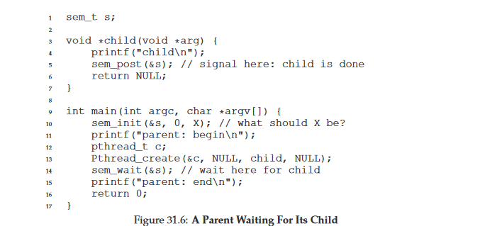
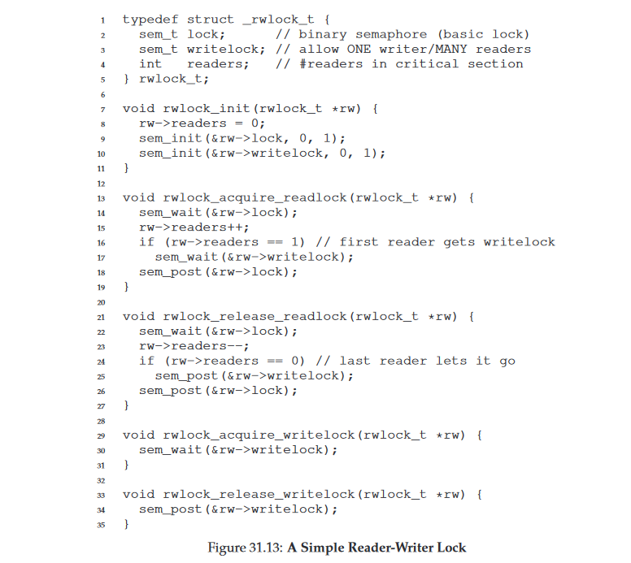
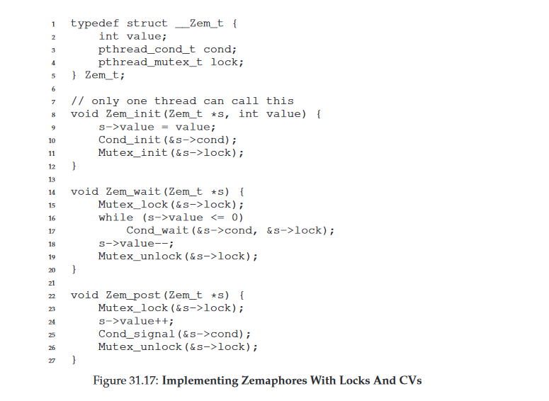

31 Semaphores 信号
===

**概述:**  
根据前面章节的介绍,我们往往需要锁(lock)和条件变量(condition variable)的结合使用来应付多种并发问题,对于开发者而言,多少还是有点复杂的.信号(Semaphore)是一种可替代的并发问题的解决手段.比起锁和条件变量的组合复杂使用,信号只对一种变量进行操作,相对而言可能对于开发者来说更简单一些.信号是一个带有整数的对象,它的定义与初始化如下:
```c
sem_t s;
sem_init(&s,0,1);
```
初始化函数sem_init的第三个参数为信号对象的整数的初始值.初始值的大小可以决定信号的功能.  
信号是通过两种原子性函数sem_wait()和sem_post()来操作.这两个函数达到的效果如下:  
  
通过这两个函数的使用,可以解决前面用锁或条件变量解决的并发问题  
1.  **二元信号(锁)**  
    初始化信号值为1时,信号可以作为锁使用.假设有以下代码:  
    ```c
    sem_t m;
    sem_init(&m,0,1);

    sem_wait(&m);
    //critical section here
    sem_post(&m);
    ```
    当有两个线程T1,T2访问时,假设T1先执行sem_wait,将信号值减1,信号值为0,因为信号值不为负,所以T1继续执行,假设执行sem_post之前T1被中端,线程切换到T2,T2执行sem_wait时,将信号值减1,此时信号值变为-1,因为是负数,所以线程会沉睡.之后线程切换到T1,T1通过sem_post将信号值加1,变为0,并唤醒T2,T2才会继续执行临界区代码.不管是多少个线程,这段代码都可以达到线程安全的目的.因此将信号初始值设为1,可以实现锁的功能.
2.  **用于顺序的信号**  
    有些场景下,我们希望其它线程先执行,比如前面介绍过的等待其它线程先完成的pthread_join()函数,使用信号也可以达到相同的功能.使用信号等待子线程先执行完的代码样例如下:  
      
    通过初始信号值为0,父线程初始化子线程后,不论调度程序让子线程先执行,还是让父线程先执行,子线程都将先执行打印出操作.假设父线程先执行,sem_wait将信号值减1,变为负值,所以会沉睡.之后必然切换到子线程执行,子线程执行打印操作后,再唤醒父线程.
3.  **用信号解决生产者/消费者多线程问题**  
    回想前面通过锁和条件变量解决生产/消费问题的解决方案.二元信号可以用作锁的功能,通过设置empty和full信号,可以实现条件变量的功能.实现代码如下(省略缓存buffer的定义与操作代码):  
    ```c
    sem_t empty;
    sem_t full;
    sem_t mutex;
    
    int main(int argc, char *argv[]) {
        sem_init($empty,0,MAX); // MAX是缓存buffer容量
        sem_init($full,0,0);
        sem_init($mutex,0,1);
    }

    void *producer(void *arg) {
        int i;
        for (i = 0; i < loops; i++) {
            sem_wait($empty);
            sem_wait(&mutex);
            put(i);
            sem_post(&mutex);
            sem_post(&full);
        }
    }

    void *consumer(void *arg) {
        int i;
        for (i = 0; i < loops; i++) {
            sem_wait(&full);
            sem_wait(&mutex);
            int tmp = get();
            sem_post(&mutex);
            sem_post(&empty);
        }
    }
    ```
4.  **用信号实现读写锁**  
    对同一份共享数据,当读数据比较多,写数据比较少的场景下,可能我们会希望尽可能的多并发读数据.使用信号的实现方案如下:  
      
5.  **用信号解决哲学家就餐问题**  
    艾兹格·迪科斯彻提过并解决一个著名的多线程问题,哲学家就餐问题.虽然现实中用到的场景不多,作为多线程处理的思路学习还是有点帮助的.哲学家就餐问题是假设有5个哲学家挨着围坐一个圆桌,每个哲学家左右两边都有一把叉子,哲学家思考的时候不会吃饭,吃饭的时候必须拿左右的两把叉子.用伪代码表示如下:  
    ```c
    { 
        while(1) {
            think();
            get_forks(p);
            eat();
            put_forks(p);
        }
    }
    ```
    因为同时需要左右两把叉子,使用信号原子性获取,放下叉子的函数可以如下定义:  
    ```c
    void get_forks(int p) {
        sem_wait(&forks[left(p)]);
        sem_wait(&forks[right(p)]);
    }

    void put_forks(int p) {
        sem_post(&forks[left(p)]);
        sem_post(&forks[right(p)]);
    }
    ```
    这样的实现方案有一个死锁问题.假设所有哲学家都同时先获取到自己左边的叉子,这时所有叉子都被获取了,所有哲学家都在等自己右边的叉子,因此造成死锁情况.解决方案就是改变某一个哲学家获取叉子的依赖顺序.其它哲学家都先获取左边的然后获取右边的,假设让最后一个哲学家先获取右边叉子再获取左边叉子则可以解决死锁问题.代码实现如下:  
    ```c
    void get_forks(int p) {
        if (p == 4) {
            sem_wait($forks[right(p)]);
            sem_wait(&forks[left(p)]);
        } else {
            sem_wait(&forks[left(p)]);
            sem_wait(&forks[right(P)]);
        }
    }
6.  **信号的简单实现**  
    使用锁和条件变量简单实现一个信号,假设叫Zemaphore,代码如下:  
    