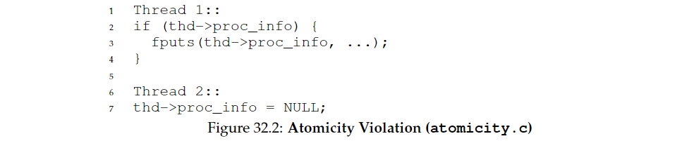
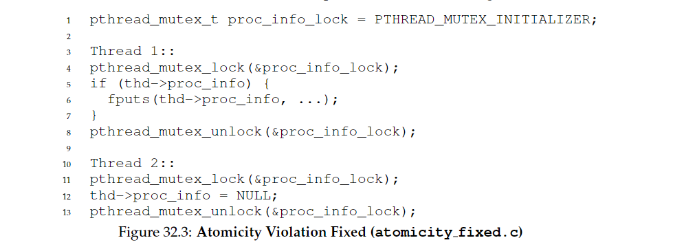
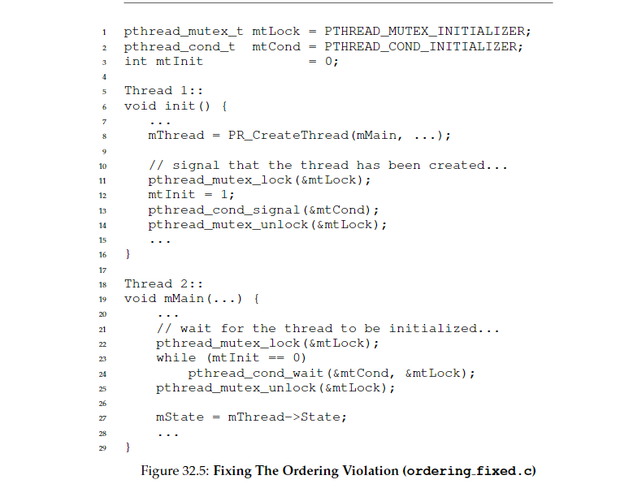
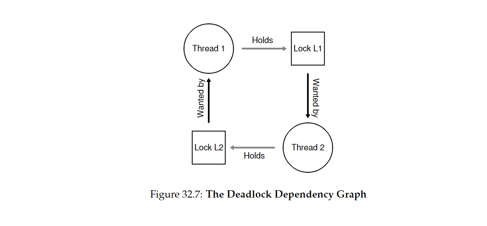

32 Concurrency Bugs 并发bug
===

**概述:**  
由于并发的复杂性和不可控性,很容易产生并发bug.并发bug主要分为死锁bug和非死锁bug.非死锁bug又主要有两类,一类是违背原子性bug,一类是违背顺序性bug.  

1.  **非死锁bug**  
    *   **违背原子性bug**  
        类似下面的场景,假如Thread1执行 if判断语句后被中断,线程切换到Thread2,共享数据被置为null,再切换到Thread1执行时就会产生null错误的bug.
          
        解决方案就是直接再临界区上下加锁.
        
    *   **违背顺序性bug**  
        类似下面的场景,假如Thread1还没初始化完成,就切换到Thread2执行,会产生null错误.
          
        如下所示,可以用条件变量解决.  
        
2.  **死锁bug**  
    类似下面的代码,假设Thread1和Thread2先分别获得L1,L2锁,此时Thread1想获取L2,Thread2想获取L1,但都互相被对方占用的状态,双方都不能获取完整的锁,陷入持续的等待中.这种状态即死锁.  
      
    下图展示了死锁状态.
    
    解决方案就是让所有线程按照同样的顺序获取锁,则可预防死锁.