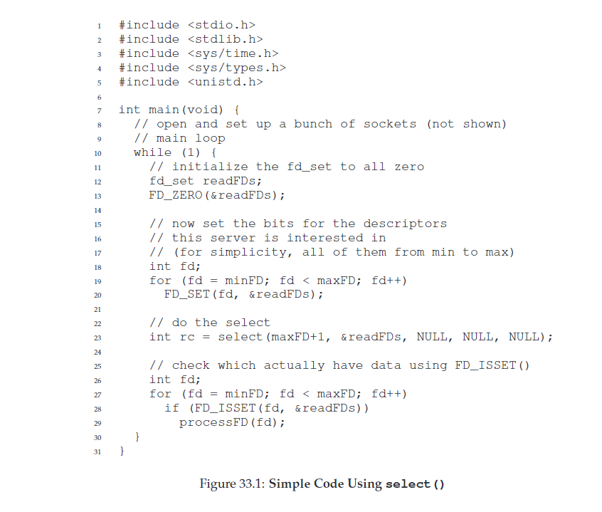

33 Event-based Concurrency 基于事件的并发
===

**概述:**  
基于线程开发的多线程有两个问题.一是比较容易出错,死锁,阻塞,资源浪费等问题需要特别小心处理;二是多线程的调度是由操作管理的,可能不会按照开发者期望的调度方式运行,因此不能精细控制程序的运行.基于事件并发是一种替代方案.它的思路是等待某些事件发生,然后判断事件类型,使用相应的代码处理.基于事件的并发有一个非常重要的架构:eventLoop().典型的基于事件的服务器的伪代码如下:  
```c
while(1) {
    events = getEvents();
    for (e in events) 
        processEvent(e);
}
```
处理逻辑非常简单,无限循环等待某些事件发生.循环处理每个事件.但是具体是如何判断发生的是哪些事件,怎么处理的? 因此需要其它的Api的支持.

1.  **基于事件的重要API:select() (or poll)**  
    select()Api是用于接收事件的.它的定义类似如下:  
    ```c
    int select(int nfds,
                fd_set *restrict readfds,
                fd_set *restrict writefds,
                fd_set *restrict errorfds,
                struct timeval *restrict timeout);
    ```
    nfds代表用户关心的所有文件描述符的最大值,readfds是用户关心读事件(是否可读)的文件描述符集合,writefds则是跟写事件相关的集合,errorfds是跟出错事件相关的集合,timeout是当没有事件发生时等待的超时时间.select返回发生事件的个数,同时readfds,writefds,errorfds内部元素替换为发生相应事件的集合.然后对这些集合做相应的处理.一个简单的使用select()代码:  
      
    从代码看,我们发现没有线程相关的锁,条件变量等,实现也是比较简单易懂的.因为同时只会有一个事件被处理,因此也不需要线程切换,就不会出现之前介绍的线程安全问题.
2.  **基于事件的并发问题**  
    *   **阻塞的系统调用**  
        纯粹的基于事件并发是不希望有阻塞发生的.上面的简单实现有一个明显问题就是阻塞的系统调用.往往涉及很多I/O操作,这些操作又会引起进程阻塞.如果阻塞发生意味着不能执行其它操作,导致资源浪费.而基于线程的并发则不会有这个问题.对于这个问题,现在系统有一种异步IO机制(Asynchronous IO) 可以解决这个问题. 它的思路是通过一种数据结构(aiocb)记录IO需要做的事情,用户调用异步IO后马上返回,异步IO根据记录的IO信息,自动执行,并提供接口给用户调用以查看异步IO是否已经完成.  
        aiocb数据结构:  
        ```c
        struct aiocb {
            int aio_fildes; //File descriptor
            off_t aio_offset; //File offfset
            volatile void *aio_buf;  //Location of buffer
            size_t aio_nbytes; //Length of transfer
        }
        ```
        异步读IO接口:
        ```c
        int aio_read(struct aiocb *aiocbp);
        ```
        查看异步IO是否已经完成接口(mac系统):  
        ```c
        int aio_error(const struct aiocb *aiocbp);
        ```
        虽然通过接口可以查询异步完成情况,但是当IO请求特别多时,调用查询接口还是比较耗费资源的.所以现代系统一般采用信号机制来通知应用IO已经完成.应用接收到中断信号后会停止当前的任务,处理中断.
    *   **状态管理**  
        基于事件的并发还有一个问题就是状态管理问题.因为基于事件并发相当于把基于线程的并发的步骤分为不同的事件,对每类事件进行几种处理.每一种事件处理完后,接下来需要干什么都需要逻辑处理.因此整个声明周期所需要的状态信息都需要管理好.有点类似于送快递.基于线程并发类似于每个人送快递是从开始地送到目的地,开始地和目的地自己都清楚,而基于事件并发,快递是分几段路程送的,每个人送一段路程,如果开始地和目的地不管理好的话,可能送不到最终目的地.
    *   **其它问题**  
        *   **多核问题**  
            当机器由单核变为多核时,为了提高效率,可想而知应该并发的处理事件.但是并发处理随之就会带来并发问题,从而不得不使用锁或线程变量.
        *   **系统集成问题**  
            前面介绍过的分页错误,分页交换等问题也可能事件处理过程中出现,势必会导致进程的阻塞,产生资源浪费.
        *   **维护问题**  
            当某些接口由阻塞变为非阻塞时,相应的处理逻辑代码也需要跟着改变.
        *   **接口的易用性问题**  
            虽然异步IO看起来非常有用,但是在应用中使用该接口并不是非常简单.