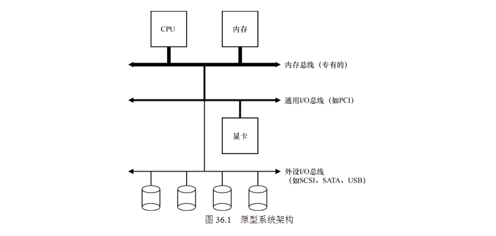
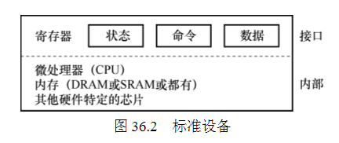

36 IO Devices IO设备
===

**概述:**  
现代计算机系统都集成了IO设备.生活中我们发现IO设备是多种多样的,有磁盘,有ssd,有u盘,有显卡等多类设备,计算机系统是怎么高效管理并运用这些IO设备的?

1.  **系统架构**  
    典型的系统架构如下:

    

    由于物理布局和造假成本的原因,要求高性能的设备离CPU比较近,低性能的设备离CPU远一些.
2.  **标准设备**  
    一个简单的标准设备的架构如下: 

    

    上面部分是设备对外提供的接口,一般设备都至少会有状态,命令,数据这三个寄存器.下面部分是设备内部具体的实现.不同的设备有不同的实现,也会有不同的设备组件.
3.  **标准协议**  
    协议如下:  
      
    第一步:反复读取设备状态寄存器,直到设备可以进入接收命令的就绪状态;  
    第二步:写入数据到数据寄存器;  
    第三步:写入命令到命令寄存器;  
    第四布:反复读取设备状态寄存器,等待是否指令是否执行完成;
4.  **中断**  
    标准协议中,轮询检查设备状态是比较费时的.采用中断,cpu不需要反复检查设备状态,当发生IO请求时,让当前线程睡眠,切换到其它线程,当IO完成时,会产生中断信号,唤醒线程继续执行.通过中断可以提高cpu的利用率.  
    注意中断并非总是最佳方案,假如有一个高性能的设备往往在第一次轮询时就返回.这种情况如果用中断反而影响性能,因为中断带来的诸如线程切换等额外操作也是由代价的.有时候综合使用轮询和中断可能是更好的方案.
5.  **DMA**  
    标准协议中还有一点需要注意,将数据传给设备时,cpu需要执行拷贝数据操作,如果数据比较大时,cpu的负担会很大.解决方案就是DMA.操作系统通过告诉DMA数据传输的相关信息,DMA会自动完成数据拷贝操作.拷贝完成后会通过中断通知操作系统.DMA拷贝数据的期间,cpu就可以执行其它任务了.
6.  **设备交互方法**  
    *   特定指令in和out
        使用特定指令in或out,将数据传入或输出到指定寄存器及一个代表设备的特定端口,系统可以自动实现期望的行为.
    *   内存映射
        将设备寄存器作为内存地址提供.操作系统直接将数据装入/存入到该映射地址,然后硬件从该地址装载/存入数据到设备.
7.  **设备驱动**  
    设备的种类有千千万万,写程序的时候不可能一一去适配不同的设备接口.操作系统的解决方案是,不管是什么设备同一提供一套接口给上层应用使用,比如文件系统.不同的设备通过不同的设备驱动程序实现统一的接口,从而向上层应用隐藏了实现细节,上层应用也无须关心不同设备的实现细节.下图展示了linux的文件系统栈.
    