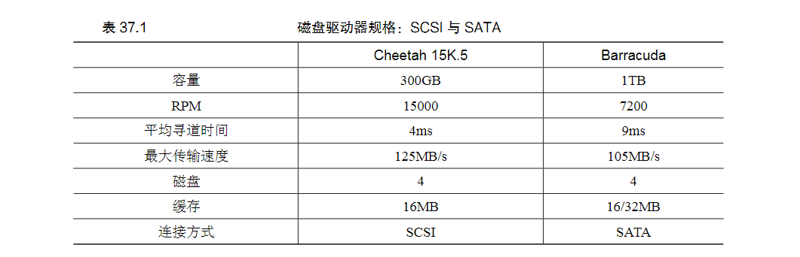

37 Hard Disk Drives 磁盘驱动器
===

**概述:**  
  因为有通用的抽象接口,实际编码时不会关心磁盘驱动器的细节实现问题,但是了解磁盘驱动器的原理和特征,有助于我们更好更高效地高效利用通用接口.
1.  **接口**  
    驱动器由大量扇区组成,每个扇区512byte.现代操作系统往往是多扇区操作.但驱动器制造商唯一保证的是单个512byte的的写入是原子的.
2.  **基本几何形状**  
    磁盘往往由多个盘面构成.盘面是一种坚硬的表面,有正面和反面两面,通过表面的磁性材料的变化来编码数据.多个盘面围绕着主轴围绕在一起.表面分布着非常多,非常细的同心圆轨道,轨道又分为若干512byte的扇区.
    扇区数据的读写是通过附着表面的磁头.磁头通过磁盘臂移动轨道,盘面围绕着主轴旋转移动.简单的磁盘驱动器如下:  
    
    如图所示,要想将磁头移动到期望的扇区,往往需要两个步骤,盘面的转动和磁头的移动,因此会带来相应的延迟,旋转延迟和寻道延迟.

3.  **IO时间** 
    IO时间可分为三部分,一是盘面旋转时间,二是磁头寻道时间,三时IO数据传输时间.简单的公式如下:  

    
    当然不同的设备往往有不同的性能.下图展示了两个设备的IO性能对比:

    
4.  **磁盘调度策略**  
    由于IO的旋转时间和寻道时间的高成本,操作系统可以通过决定IO任务的执行顺序,来减少不必要的扇区定位时间.与进程切换调度不同,进程的执行时间是无法预判的,但是IO的扇区定位时间是可以预先计算的,操作系统应该遵循最短任务时间的原则进行调度.下面介绍一些策略:  
    * SSTF:最短寻道时间优先
      优先执行离磁头近的轨道的IO请求.缺点是忽略了旋转时间的影响,以及可能会引发某些IO请求的饥饿.

    * SCAN:电梯调度算法
      简单的以跨越磁道的顺序反复扫描盘面磁道,当遇到IO请求时则处理IO请求,扫描过的磁道有请求时则会等下次扫描时执行,优点是实现简单,且不会引发饥饿.

    * SPTF:最短定位时间算法
      综合考虑了旋转和寻道时间,优先执行二者时间所需较少的IO请求.