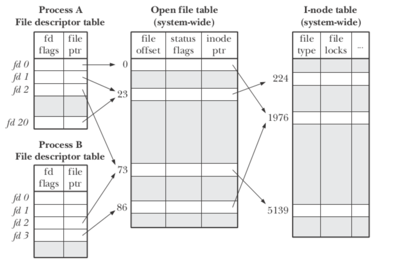

39 Files and Directories 文件和目录
===

**概述:**  
前面我们介绍了cpu和内存的虚拟化,就差对存储设备的虚拟化了. 存储设备的虚拟化是通过文件系统来实现的.文件系统主要又分为文件和目录.

1.  **文件**  
    文件是由一组二进制数据构成的集合体.文件系统为每一个文件分配一个唯一的inumber数字,通过被称为inode的数据结构对文件信息进行管理和追踪.我们在显示所看到的文件名,其实是一种映射指向底层的inode文件.  
    操作文件的接口如下:  
    *   创建文件
        文件通过open函数创建.创建方式类似这样: int fd = open("foo", O_CREAT | O_WRONLY | O_TRUNC); open函数第一个参数为文件名,第二个参数指定创建模式.open返回的数字为文件描述符,为进程私有,通过该描述符操作底层文件.
    *   读写文件
        介绍读写文件接口之前先介绍open file table (打开文件表).每一个进程都会有一个文件描述符表用来记录打开的文件映射,每一个文件描述符指向系统全局共享的open file table,它里面每一项又指向底层文件并记录当前文件的已经读写到的位置.当调用读写接口时就会用到这个位置信息offset,指明从哪里读或写.同时还记录被多少个文件描述符所引用.它的示意图如下:  

        
        有了open file table就能更好理解读写接口了.读写接口都是系统调用.读接口是read,写接口是write.它们都是通过操作文件描述来对文件进行读写操作.具体的参数信息略过.
    *   lseek 非顺序读写文件
        当我们想从文件的特定位置开始读/写数据时,可以通过lseek接口来更改open file table所对应的offset来指定位置.
    *   fsync立即写入
        有一点我们需要注意的是,写接口write并不是立即将数据写入磁盘.因为写数据入磁盘是代价比较大的操作.系统会先缓存数据然后统一写入磁盘,以提高性能.但有一些应用比如关系数据库,对数据的正确存储要求比较高,它们可以使用fsync立即写入接口,来确保数据的写入完成.
    *   文件重命名
        文件重命名通过rename(char*old, char*new)接口,它的操作是原子性的.常用的linux命令mv的底层就是调用这个接口.
    *   获取文件信息
        通过stat接口可以获取以下数据结构的文件相关信息.

        

    *   删除文件
        删除文件调用的是unlink()接口,作用是删除文件名和底层inode文件的映射.inode文件会记录有多少个文件名引用它,当引用数为0时,才会真正删除文件.

    *   硬链接
        可以通过ln链接接口,将文件名映射到底层inode文件.一个inode文件可以有多个文件名映射. 比如命令ln file file2, 将文件名file2映射到file指向的inode文件.
2.  **目录**  
    目录是管理文件和子目录的集合体.文件系统也为每个目录分配唯一的inumber数字.也通过inode数据结构进行信息管理和追踪.但它里面的信息主要包括文件或目录的可视化名称和底层的inumber映射信息.
    操作目录的接口如下:  
    *   创建目录
        创建目录通过mkdir接口.目录创建后默认带有指向自己和上级目录的空目录文件 "." 和 ".."
    *   读取目录
        读取目录一般步骤是调用opendir打开目录,readdir读取目录,closedir关闭目录三个调用完成.
    *   删除目录
        因为目录一般都有很多文件和子目录数据,为防止误删,一般只允许删除空目录.当然使用一些命令参数可以强制删除有数据的目录.
3.  **挂载文件系统**  
    有些系统可能有多个存储设备,为了方便管理,可以通过mount调用将设备的目录挂载到文件系统的某一目录下达到统一管理的目的.调用方式类似这样:mount /dev/sda1 /home/user 将设备分区/dev/sda1目录挂载到/home/user下,原来在/dev/sda1下的文件目录就可以通过/home/user访问了.