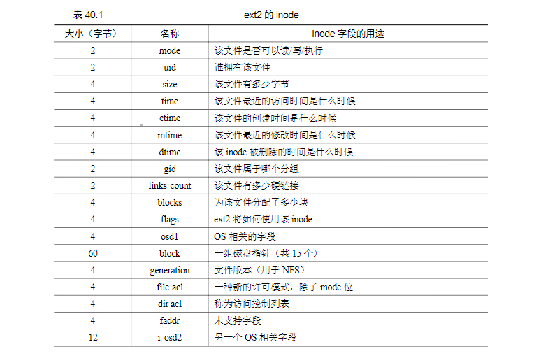
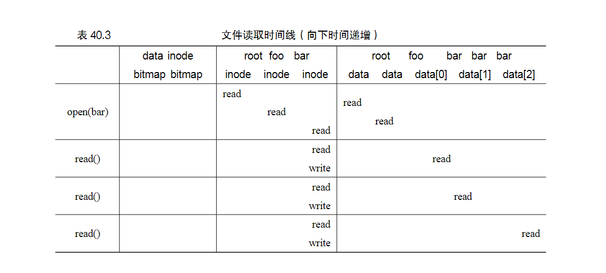
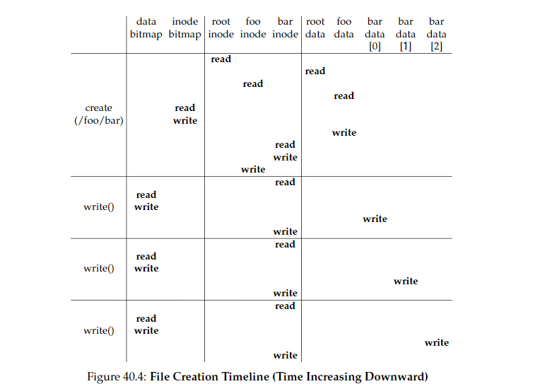

40 File System Implementation 文件系统实现
===

**概述:**  
这一章主要介绍文件系统是通过什么组织形式,数据结构来管理文件的.

1.  **简单的文件系统模型**  
    简单的文件系统模型如下图所示:  
      
    首先可以想到的是,文件系统必须要有存储数据的地方,即上图的数据区域.为了方便管理,文件系统把存储空间分为定长的块block(为了简单,假设统一成4kb大小),文件都由这些块构成.有了这些块当然也得有管理这些块的地方,即上图的inodes区域.inodes区域占用了几个块(上图是5个).每个inode是定长(假设统一为256byte)的数据结构,负责管理一个文件的信息,包括包含多少个块,具体是哪些块,最近访问时间等信息.  
    在给新文件分配inode和数据块时,需要知道空闲的inode和数据块信息,所以也需要有地方来记录inode和数据块block的分配情况.上图的inodes旁边的i和d数据块则分别用来标记inode和数据库的分配情况.它们都是用bitmap位图结构来标记,每一个位用于指示相应对象/块是否被分配,1表示分配.  
    最前面的S超级块用来记录文件系统的元数据,包括有多少个inode和block,inodes的起始位置等.
2.  **文件组织inode**  
    inode负责管理详细的文件信息.inode的存储方式的概念图如下:  
    ,每一个inode都有一个编号按顺序排列.因为inode是定长的所以根据inode编号可以很容易计算除inode的具体物理地址.  
    inode主要管理类似下面的信息:  
    
    其中最主要的就是block的指针信息,它表示构成文件的具体块的位置信息.通过它我们才能定位到真实的block.
3.  **文件的读写**  
    *   **读文件**  
        读文件要经历两个步骤open和read.open打开文件的意思是根据文件路径先找到文件的inode,步骤是从根目录逐层读取文件的上层目录信息直到最终找到inode文件.读取下一个目录的步骤一般分为两步,首先在当前目录的数据块找到该目录的目录名与inode的映射,然后读取该目录的inode.  
        找到文件inode后就可以开始read了,读取每一个块会现在inode里查询该块的位置然后再读取,读取完成后还要更新inode的最新访问时间.  
        读取/foo/bar文件3个块的流程图如下:  
        
    *   **写文件**  
        写入文件的步骤要比读取文件的步骤多一些,因为涉及到块的分配.除了打开文件的操作,在写入新块时,会更新块位图标记使用了哪个块,还会更新inode的块位置信息.  
        创建一个/foo/bar文件并写入3个块数据的流程类似下图:  
        
        
4.  **文件系统的缓存** 
    在上面介绍的文件读写过程中,文件的打开操作以及文件inode的更新操作都比较多,而这些数据都是存放在磁盘里的,因此会引发很多IO操作.为了避免过多的IO,提高性能,自然想到将数据缓存.现代系统通常将文件系统常用的块缓存,将写入缓冲若干秒.从而可批量写入减少IO次数.

    